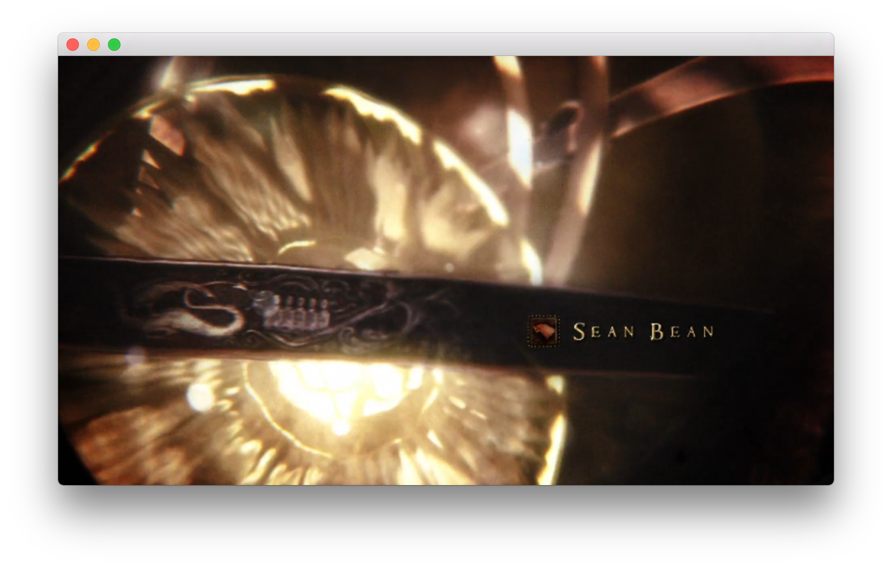

# playback-native

Use tint2 and WebChimera.js to initialize a window with VLC playing inside of it - controllable through JavaScript.

**WARNING: currently OS X only**

Running
--------
```
npm install
npm start
```

Screenshot
---------


Why is WebChimera.js a submodule
---------
Since creating this involves modifications to WebChimera.js, it's easier to use a submodule to a fork.

